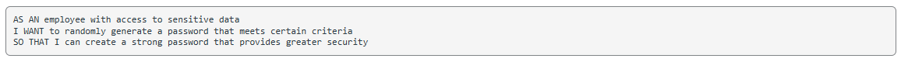
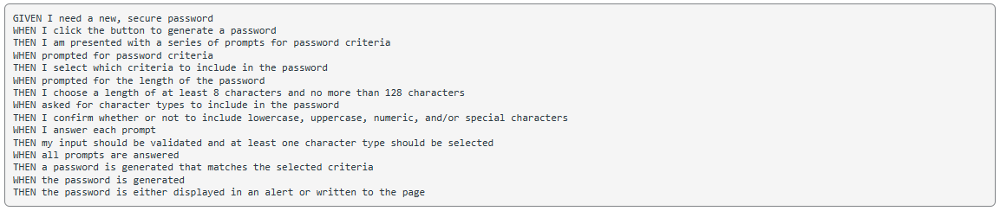

# Password Generator Starter Code

# About: 'password-generator' will generator a random password using criteria preferences submitted by the user. To use this generator, the user must provide the desired length of their password (a number between 8 and 128). Then, the user will be prompted for the password criteria requirment (uppper case, lower case, numeric and special character). Once the criteria is established, the password generator will generate a random string based off the chosen criteria.

# Respository: https://github.com/RyanMcElwee/Password-Generator-4

# Published site: